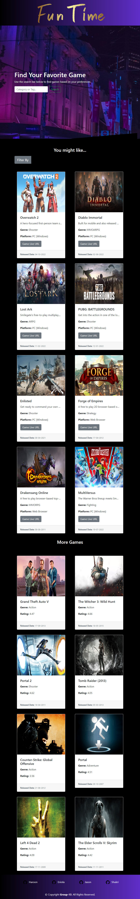

# Fun Time App

## Description
Fun-time is a game searching app that would allow gamers to search for games on different criteria such as genre, name or release date. when the user does a search then it will render number of games related to their search enquiry. Here is the deployed app link [Fun Time](https://shukri74.github.io/fun-time/)

## Installation
To use this Web App you do not need to install any software or tool.You just need a browser and internet connection to visit this website.

## Usage

To use our page, simply enter your preffered game genre or tag which describes the type of game you are looking for and click 'Search' and a list of results will be presented to you below.

Under your list of results, there is a section which shows other recommended titles.

### Desktop View screenshort:

### Tablet View screenshort:

### Mobile View screenshort:

## Technologies used in this Application

HTML5

Bootstrap 4

jQuery

Two different API's (freetogame.com and rawg.io)

## Credits

[Bootstrap 4](https://getbootstrap.com/docs/4.0)

[Freetogame Api](https://www.freetogame.com/api-doc)

[RAWG Api](https://api.rawg.io/docs/#operation/games_list)

[JQuery](https://api.jqueryui.com/)

## License

Copyright (c) 2023 Group-13

